# Starina

Starina (named after [stellina](https://en.wiktionary.org/wiki/stellina)), is a general-purpose, microkernel-based, modern operating system designed for developers. It aims to be a production-ready OS, and more importantly, a fun and easy-to-understand OS where you can enjoy the development as if you are writing a Web application.

## Philosophy

The ultimate goal of this project is to create a production-ready OS to be a good alternative to real-world OSes. To make this happen, Starina values the following principles:

- **Userspace-first approach:** Make OS development approachable and fun for everyone. Prioritize developer experience in the userspace, where the most OS components reside. The microkernel is just a runtime for applications.
- **Simplicity over perfection:** Emphasize a straightforward design which covers the most common use cases. Make it work first. Make it better later.
- **Incrementally adoptable:** Facilitate easy adoption of Starina by providing a seamless integration with existing systems.

## 2025 Roadmap

This year we're focusing on cloud computing, with [starina.dev](https://starina.dev) running on Starina's Linux compatibility layer:



- [x] Microkernel prototype in Rust ([starina.dev](https://starina.dev) running on Linux/QEMU!)
- [x] Complete redesign and rewrite
- [x] Rust-based zero-cost isolation ([unikernel](https://en.wikipedia.org/wiki/Unikernel) style)
- [x] Device tree support
- [x] Asynchronous message passing + epoll-like event driven API
- [x] Declarative OS service discovery
- [x] TCP/IP networking
- [x] Virtio-net device driver
- [x] WSL2-like Linux compatibility layer
- [x] Linux container image support (`docker run`-like experience)
- [ ] Shell (in an unopinionated headless Web-based approach)
- [ ] File system server
- [ ] TypeScript (WebAssembly-based) or Swift (Embedded Swift) API
- [ ] Traditional usermode-based isolation

## Getting Started

Install dependencies:

```bash
./setup.sh
```

Build and run:

```bash
./run.sh
```

Debug with GDB (keep `run.sh` running in another terminal):

```bash
./debug.sh
```


## Linux compatibility layer

Starina provides a lightweight VM based Linux compatibility library with an ergonomic `std::process::Command`-like API. Learn more in [this blog post](https://seiya.me/blog/hypervisor-as-a-library).

Also, `run.sh` starts a single Linux container automatically to demonstrate the Linux integration. Set `LINUXRUN_IMAGE` and `LINUXRUN_ENTRYPOINT` to specify the image name and entrypoint:

```
$ export LINUXRUN_IMAGE="docker://hello-world:latest"
$ export LINUXRUN_ENTRYPOINT="/hello"
$ ./run.sh
[kernel      ] INFO   Booting Starina...
...
[linuxrun    ] INFO
Hello from Docker!
This message shows that your installation appears to be working correctly.

To generate this message, Docker took the following steps:
 1. The Docker client contacted the Docker daemon.
 2. The Docker daemon pulled the "hello-world" image from the Docker Hub.
    (riscv64)
 3. The Docker daemon created a new container from that image which runs the
    executable that produces the output you are currently reading.
 4. The Docker daemon streamed that output to the Docker client, which sent it
    to your terminal.

To try something more ambitious, you can run an Ubuntu container with:
 $ docker run -it ubuntu bash

Share images, automate workflows, and more with a free Docker ID:
 https://hub.docker.com/

For more examples and ideas, visit:
 https://docs.docker.com/get-started/
```

## Why Rust?

We (and perhaps you too) love to debate the best text editor and programming language, sometimes very seriously and passionately.

Starina is entirely written in Rust because it is *"C++ with seatbelts"*, which is suitable for building a robust yet high-performance OS. Seatbelts are sometimes annoying indeed, but we know it saved us from countless bugs by enforcing good practices. Notably, I don't need address sanitizer when writing Rust. That's a huge factor for me.

That said, it's crystal clear that Rust (or any other language) is not the best language for everything. That's why Starina is designed to be language-agnostic, and I plan to add seamless support for other languages such as TypeScript. What if you can prototype OS components such as device drivers, as if you are writing a Web app? Isn't that cool?
